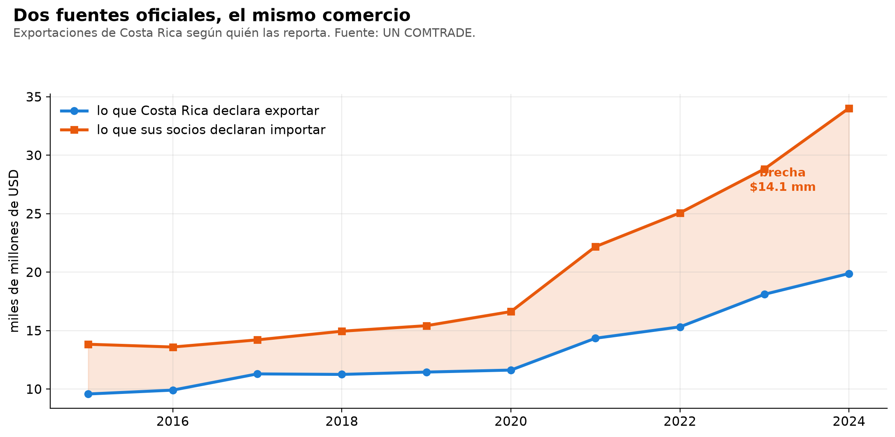
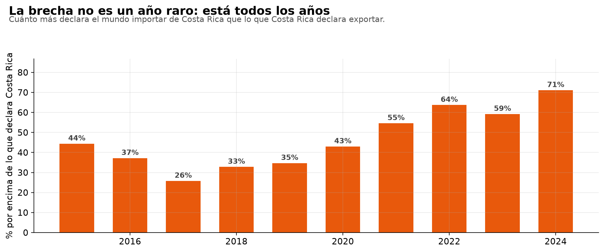
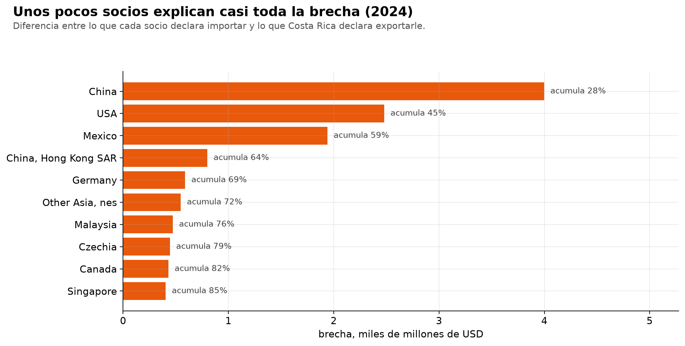

# Costa Rica y sus socios no reportan el mismo comercio

*[English version](README.en.md)*

**En 2024, Costa Rica declaró exportar $19,9 mm al mundo. Sus socios declararon
haber importado $34,0 mm de Costa Rica. La diferencia es de $14.140 millones —
un 71 %— y no para de crecer.**



Cada transacción internacional se registra dos veces: una por quien exporta y
otra por quien importa. En teoría las dos cifras deberían coincidir. Nunca
coinciden, y esa diferencia —la *estadística espejo*— es lo que aduanas y bancos
centrales usan para detectar subfacturación, reexportación y errores de
clasificación.



La brecha existe los diez años, nunca baja de 25 % y pasó de 44 % en 2015 a 71 %
en 2024.

## Tres socios explican la mitad



| Socio | CR declara (promedio) | Brecha media | Desviación | Acumulada |
|---|---:|---:|---:|---:|
| **Estados Unidos** | $5.795 M | **+17,3 %** | 10,2 | $11,15 mm |
| **China** | $220 M | **+627 %** | 396 | $12,40 mm |
| **Bélgica** | $705 M | **−37,7 %** | **7,0** | −$2,61 mm |

Son tres fenómenos distintos, y esa es la conclusión del trabajo:

**Estados Unidos, +17 % con poca dispersión.** Es el orden de magnitud que
explican la valoración FOB contra CIF —las importaciones incluyen flete y
seguro— más los desfases de registro. Es la brecha «normal».

**China, +627 %.** Eso no es flete. Costa Rica declara exportarle $220 millones
al año y China declara importar seis veces más. La hipótesis a contrastar es
atribución de origen: mercancía de zona franca que se vende a un intermediario y
que el país de destino registra con origen Costa Rica.

**Bélgica, −37,7 % con desviación de 7.** El caso inverso, y el más consistente
de todos: Costa Rica declara sistemáticamente **más** de lo que Bélgica declara
recibir. Una brecha de un año es un error; una que se repite diez años con
desviación de 7 puntos es estructural.

## Correr

```bash
pip install duckdb pandas requests matplotlib
python 01_bajar.py      # UN COMTRADE, cacheado
python 03_reporte.py    # corre 02_analisis.sql y saca el reporte
python 04_figuras.py
```

| Archivo | Qué hace |
|---|---|
| `01_bajar.py` | los dos lados del espejo, con caché y reintento ante HTTP 429 |
| `02_analisis.sql` | **todo el análisis**: el par, la brecha, el aporte, la persistencia y los chequeos |
| `03_reporte.py` | corre el SQL e imprime. Python solo orquesta |
| `04_figuras.py` | las tres figuras |
| `EJERCICIOS.md` | diez ejercicios para reescribir las consultas sin mirarlas |

## Por qué el análisis está en SQL

Porque es un problema de reconciliación entre dos fuentes, y eso es lo que SQL
hace mejor que cualquier otra herramienta. Las consultas usan `FULL OUTER JOIN`,
CTEs encadenados, `SUM() OVER` para el acumulado, `ROW_NUMBER() OVER (PARTITION
BY)` para el ranking por año, y `GROUP BY` con `HAVING`.

**El `FULL OUTER JOIN` no es adorno.** Con un `INNER` se pierden los socios que
aparecen de un solo lado, y esos son precisamente un hallazgo: en 2024 hubo 17
socios que solo declaró el otro país y 41 que solo declaró Costa Rica.

## El error que este proyecto casi comete

La primera versión de la vista de persistencia ordenaba por brecha porcentual
media. El resultado encabezaba con **Serbia, con una brecha de 20 millones por
ciento**.

Era cierto y era inútil: Costa Rica declaraba unos cientos de dólares y Serbia
unos miles. **Un porcentaje no significa nada cuando el denominador es
diminuto.** La vista ahora exige un comercio medio de al menos $20 millones y
ordena por monto, no por porcentaje.

Está documentado en el propio SQL porque es el tipo de error que se cuela en un
análisis y nadie revisa.

## Chequeos de calidad

Cada chequeo devuelve **las filas que fallan**, no un booleano:

| Chequeo | Resultado |
|---|---:|
| Socios sin contraparte | 530 |
| Brechas extremas sobre 200 % | 451 |
| Costa Rica declara más que el socio | 155 |
| Duplicados por año y socio | 0 |

Los dos primeros se concentran en socios de comercio marginal. El tercero es el
interesante: son los casos que van contra la teoría y merecen explicación.

## Limitaciones

- **No se descompone la brecha.** Saber cuánto corresponde a FOB/CIF, cuánto a
  reexportación y cuánto queda sin explicar exige datos de flete y de origen que
  COMTRADE no publica. Lo que sí se puede afirmar es que 17 % es compatible con
  FOB/CIF y 627 % no.
- **El análisis es a nivel total.** Desagregar por capítulo mostraría si la
  brecha se concentra en los productos de zona franca, que es la hipótesis.
- **Las cifras de COMTRADE se revisan.** Los años recientes pueden cambiar.

## Datos

UN COMTRADE, público y sin llave. Costa Rica es el reporter 188. 2015-2024.

Detalle que salió de probar la API y no del manual: al pedir varios reporters, la
respuesta se desglosa por régimen aduanero, modo de transporte y segundo socio, y
corta en 500 registros. Hay que fijar `customsCode=C00`, `motCode=0` y
`partner2Code=0` para traer el agregado. Sin eso los números salen mal y no se
nota.
